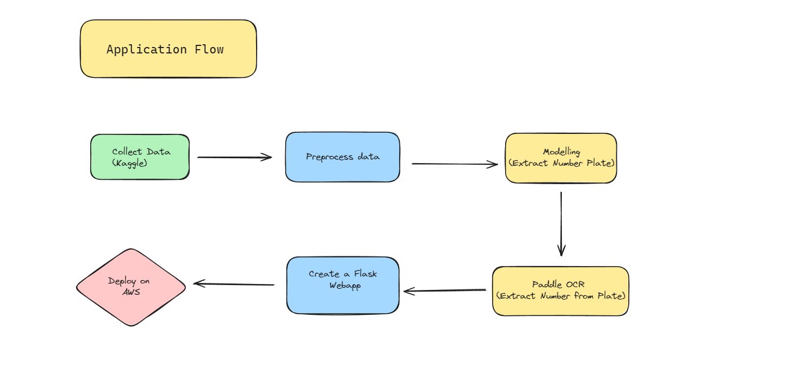

# Car Number Plate Detection

## Overview

This project aims to develop a system to detect and read vehicle number plates from images. The system uses Object Detection techniques to locate the number plate in a picture and Optical Character Recognition (OCR) to convert the plate’s characters into readable text.

The application flow of the project is illustrated below:



## Technologies Used

- **Deep Learning Framework**: PyTorch
- **Object Detection**: Faster R-CNN (or another method based on your implementation)
- **OCR**: Paddle OCR
- **Programming Language**: Python

## Installation Instructions

### Prerequisites

Ensure you have Python 3 installed on your system. If not, you can download it from [python.org](https://www.python.org/downloads/).

### Clone the Repository

**Clone the repository to your local machine:**

- Go to terminal and change directory where you want to clone project and then run:

    ```bash
    git clone https://github.com/kameshcodes/cars-number-plate-recognition-project.git

    ```

    Now, go inside the project directory in the IDE terminal using the following command

    ```bash
    cd cars-number-plate-recognition-project
    ```

    **Optional Step:** If you are using VS Code, run:

    ```bash
    code .
    ```

This will open the project inside the visual studio code directly.

### Project Setup

Now Inside VS Code terminal, follow the instructions given below to setup the project dependencies and requriments:

1. **Create a Virtual Environment:**

    ```bash
    python -m venv venv
    ```

   - **On Windows:**

    ```bash
    venv\Scripts\activate
    ```

   - **On macOS and Linux:**

    ```bash
    source venv/bin/activate
    ```

2. **Upgrade pip to the latest version:**

    ```bash
    python -m pip install --upgrade pip
    ```

3. **Install Requirements and Dependencies:**

    ```bash
    pip install -r requirements.txt
    ```

4. **Connect Virtual Environment to Jupyter Kernel:**

    - **Install ipykernel**

    ```bash
    pip install ipykernel 
    ```

    - **Connect venv to Jupyter Kernel**

    ```bash
    python -m ipykernel install --user --name=venv --display-name venv
    ```

5. **Add Kaggle API:**

   To access Kaggle datasets from kaggle for downloading, you need a Kaggle API key. Follow these steps:

   - **Obtain Kaggle API Key:
     - Go to your [Kaggle Account Settings](https://www.kaggle.com/settings) (Login if required).
     - Scroll down to the **API** section and click **Create New API Token**. This will download a `.kaggle` folder containing the `kaggle.json` file or `kaggle.json` directly.
     - Open the `kaggle.json` file and retirive:
       - `your_username` - your Kaggle username
       - `your_api_key` - your Kaggle API key

   - **Add Credentials to `.env` File:**
     1. Create a new file named `.env` inside project folder
     2. Add the following lines to the `.env` file:

        ```plaintext
        KAGGLE_USERNAME=your_username
        KAGGLE_KEY=your_api_key
        ```

    You will get your_username and your_api_key from the `kaggle.json` file
